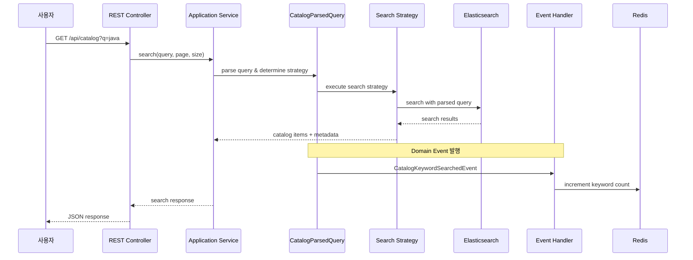
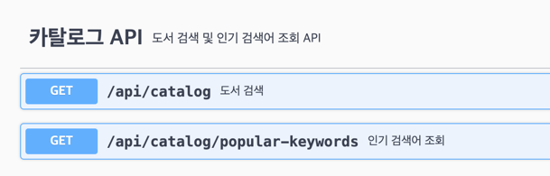

## 목차

- [프로젝트 설명](#프로젝트-설명)
- [도메인 모델 설명](#도메인-모델-설명)
- [실행 방법](#실행-방법-execution-instructions)
- [API 문서](#api-문서-api-documentation)
- [기술 스택 및 선택 이유](#기술-스택-및-선택-이유)
- [아키텍처 결정 사항](#아키텍처-결정-사항)
- [문제 해결 중 고민 과정](#문제-해결-중-고민-과정)
- [아쉬웠던 점](#아쉬웠던-점)

## 프로젝트 설명

이 프로젝트는 사용자가 원하는 책을 쉽게 찾고, 현재 많이 검색되는 키워드를 함께 확인할 수 있도록 만든 도서 검색 API입니다. 

### 주요 기능
- **도서 검색**: 제목, 저자, 부제목을 통한 다양한 검색 옵션
- **고급 검색**: OR 연산자(`|`), NOT 연산자(`-`)를 활용한 복합 검색 지원  
- **인기 검색어 추적**: Redis 기반 인기 검색어 제공
- **API 문서화**: Swagger UI를 통한 인터랙티브 API 명세서 제공
- **초기 데이터 시드**: IT Bookstore API를 활용한 도서 데이터 수집

### API 플로우



### 대략적인 프로젝트 폴더 구조

```
book-search/
├── src/
│   ├── main/
│   │   ├── java/me/yunhui/
│   │   │   ├── BookSearchApplication.java
│   │   │   ├── catalog/
│   │   │   │   ├── application/              # 응용 서비스
│   │   │   │   ├── domain/                   # 도메인 계층
│   │   │   │   │   ├── entity/               # 도메인 엔티티
│   │   │   │   │   ├── event/                # 도메인 이벤트
│   │   │   │   │   ├── exception/            # 도메인 예외
│   │   │   │   │   ├── handler/              # 이벤트 핸들러
│   │   │   │   │   ├── repository/           # 도메인 리포지토리 인터페이스
│   │   │   │   │   ├── service/              # 도메인 서비스
│   │   │   │   │   │   └── strategy/         # 검색 전략 구현체
│   │   │   │   │   └── vo/                   # 값 객체
│   │   │   │   ├── infrastructure/           # 인프라스트럭처 계층
│   │   │   │   │   ├── config/               # 설정
│   │   │   │   │   ├── elasticsearch/        # Elasticsearch 구현
│   │   │   │   │   ├── event/                # 인프라 이벤트 핸들러
│   │   │   │   │   ├── redis/                # Redis 구현
│   │   │   │   │   └── runner/               # 애플리케이션 실행 시 작업
│   │   │   │   └── interfaces/               # 인터페이스 계층
│   │   │   │       ├── dto/                  # 데이터 전송 객체
│   │   │   │       └── rest/                 # REST 컨트롤러
│   │   │   └── shared/                       # 공통 도메인 요소
│   │   │       ├── config/
│   │   │       └── domain/
│   │   └── resources/
│   └── test/                                 # 테스트 코드
├── build.gradle.kts                          # Gradle 빌드 설정
├── docker-compose.yml                        # Docker 컴포즈 설정
├── Dockerfile                                # Docker 이미지 빌드
└── README.md
```

### 아키텍처 특징
- **DDD (Domain-Driven Design)**: 도메인 중심의 계층형 구조
- **이벤트 기반**: 도메인 이벤트를 활용한 느슨한 결합
- **전략 패턴**: 다양한 검색 방식을 전략으로 구현

## 도메인 모델 설명

#### 1. CatalogItem (도서 카탈로그 항목) - DomainEntity
```java
public class CatalogItem implements DomainEntity<String> {
    private final String id;           // 고유 식별자
    private final String title;        // 도서 제목
    private final String subtitle;     // 부제목
    private final String author;       // 저자
    private final String isbn;         // ISBN 번호
    //  (...중략...)
    
```

#### 2. CatalogQuery (검색 쿼리) - ValueObject
```java
public class CatalogQuery extends ValueObject {
    private final String query;  // 검색어
    private final int page;      // 페이지 번호
    private final int size;      // 페이지 크기
}
```

#### 3. CatalogParsedQuery (파싱된 검색 쿼리) - Aggregate Root
검색어를 파싱하여 검색 전략을 결정하는 애그리게이트 루트입니다.
- **단순 검색**: 일반적인 키워드 검색
- **OR 검색**: `keyword1|keyword2` 형태의 합집합 검색
- **NOT 검색**: `keyword1-keyword2` 형태의 차집합 검색

### 도메인 이벤트
- **CatalogKeywordSearchedEvent**: 검색 키워드 추적을 위한 도메인 이벤트

### 검색 전략 패턴
프로젝트는 **Strategy Pattern**을 활용하여 다양한 검색 방식을 지원합니다:

- `DefaultSearchStrategy`: 단일 키워드 기본 검색
- `OrSearchStrategy`: OR 연산자를 활용한 합집합 검색
- `NotSearchStrategy`: NOT 연산자를 활용한 차집합 검색

## 실행 방법 (Execution Instructions)

### 전제 조건
- **Java 21** 이상
- **Docker** 및 **Docker Compose**
- **Gradle** (또는 프로젝트에 포함된 Gradle Wrapper 사용)

### (옵션 1). Docker Compose를 통한 전체 실행

```bash
  # 모든 서비스를 함께 시작 (권장)
  docker-compose up -d

  # 로그 확인
  docker-compose logs -f book-search-api
```

### (옵션 2). 로컬 환경에서 실행

#### Step 1: 의존성 서비스 시작
```bash
  # Docker Compose를 통해 Elasticsearch와 Redis 시작
  docker-compose up elasticsearch redis -d

  # 서비스 상태 확인
  docker-compose ps
```

#### Step 2: 애플리케이션 실행
```bash
  # Gradle을 통한 실행
  ./gradlew bootRun

  # 또는 JAR 파일 빌드 후 실행
  ./gradlew build
  java -jar build/libs/book-search-1.0-SNAPSHOT.jar
```

### 애플리케이션 접근

- **API 서버**: http://localhost:8080
- **Swagger UI**: http://localhost:8080/swagger-ui/index.html
- **Elasticsearch**: http://localhost:9200
- **Kibana**: http://localhost:5601
- **Redis**: localhost:6379

### 초기 데이터 설정

애플리케이션 시작 시 자동으로 IT Bookstore API에서 도서 데이터를 수집합니다.
수동으로 데이터 시드를 실행하려면:

```bash
   # 애플리케이션이 실행된 상태에서
   curl -X POST http://localhost:8080/api/catalog/seed
```

## API 문서 (API Documentation)

### Swagger UI 
프로젝트는 **SpringDoc OpenAPI 3**를 사용하여 자동 API 문서를 제공합니다.
- **URL**: http://localhost:8080/swagger-ui/index.html

### 주요 엔드포인트



#### 1. 도서 검색
```http
GET /api/catalog?q={검색어}&page={페이지}&size={크기}
```

**매개변수:**
- `q` (필수): 검색어
- `page` (선택): 페이지 번호 (기본값: 0)
- `size` (선택): 페이지 크기 (기본값: 10, 최대: 100)

**검색 예시:**
```bash
   # 기본 검색
   curl "http://localhost:8080/api/catalog?q=java"
   # 페이지네이션
   curl "http://localhost:8080/api/catalog?q=javascript&page=1&size=5"
```

**응답 예시:**
```json
   {
     "searchQuery": "java",
     "data": [
       {
         "id": "uuid",
         "title": "Java: The Complete Reference",
         "subtitle": "Eleventh Edition",
         "imageUrl": "https://...",
         "author": "Herbert Schildt",
         "isbn": "978-1260463330",
         "published": "2020-03-20"
       }
     ],
     "pageInfo": {
       "currentPage": 1,
       "pageSize": 10,
       "totalElements": 45,
       "totalPages": 5
     },
     "searchMetadata": {
       "executionTime": 25,
       "strategy": "MULTI_MATCH"
     }
   }
```

#### 2. 인기 검색어 조회
```http
GET /api/catalog/popular-keywords
```

**응답 예시:**
```json
{
  "keywords": [
    {
      "keyword": "java"
    },
    {
      "keyword": "java spring"
    }
  ],
  "totalCount": 2 
}
```

## 기술 스택 및 선택 이유

### 핵심 기술 스택

| 기술 | 버전 |
|------|------|
| **Java** | 21 |
| **Spring Boot** | 3.2.8 |
| **Elasticsearch** | 8.12.0 |
| **Redis** | 7.2 |
| **SpringDoc OpenAPI** | 2.2.0 |

### 상세 기술 선택 근거

#### 1. **Elasticsearch 선택 이유**

- **다중 필드 검색 지원**  
  책 제목, 저자 등 여러 필드를 대상으로 검색이 가능하며, 정확한 일치뿐 아니라 **유사 검색(fuzzy search)** 도 지원해야 했습니다.

- **PostgreSQL의 한계**  
  PostgreSQL에서 `GIN` 인덱스를 활용한 트라이(trie) 기반 검색은 3글자 미만의 문자열에서는 인덱스가 적용되지 않아 효율이 떨어지는 문제가 있습니다.  
  (참고: [관련 코드](https://github.com/dst03106/db_playground/blob/cb11f9d000497c5a976299ce83b06dfd10f372e3/gin_index_optimization/tests/postgresql/test_gin_index_optimization.py#L33))

- **Elasticsearch의 장점**  
  Elasticsearch는 **역인덱스 기반 검색**에 특화되어 있어, 위와 같은 제약 없이 빠른 검색 성능을 보장할 수 있습니다.
  다만, 역인덱싱 과정에서 색인 부하가 발생하기 때문에 **검색이 불필요한 필드(예: `imageURL`, `isbn`)** 는 `keyword` 타입으로 지정해 불필요한 부하를 줄였습니다.

- **OpenSearch 대신 Elasticsearch를 선택한 이유**  
  Spring에서 기본적으로 Elasticsearch 연동을 제공하며, Elasticsearch 8.x 버전은 OpenSearch와 완벽히 호환되지 않습니다.  
  따라서 **레퍼런스 및 구현 편의성** 측면에서 Elasticsearch를 선택하는 것이 더 유리하다고 판단했습니다.


#### 2. **Redis 선택 이유**

- **고성능**: 인메모리 저장으로 빠른 읽기/쓰기
- **데이터 구조**: Sorted Sets을 활용한 효율적인 랭킹 시스템

## 아키텍처 결정 사항

### 1. 도서 검색 도메인의 Aggregate Root를 CatalogParsedQuery로 한 이유
- 도서 검색 도메인의 핵심 관심사는 책 자체가 아니라 '검색 요청과 전략'이라고 생각했습니다.
- CatalogParsedQuery는 파싱된 키워드와 파싱 전략을 중심으로 비즈니스 로직을 담고 있으며, 도메인 이벤트도 발행하기 때문에 Aggregate Root로 적합하다고 보았습니다.
- 반면 CatalogQuery는 단순히 `query`, `page`, `size`와 같은 원시 요청 정보를 담을 뿐이며, 연산이 파싱되지 않았기 때문에 **Value Object**로 정의하였습니다.

### 2. 도서 검색 도메인에서 Pagination을 catalog의 domain에 넣은 이유
- Pagination은 일반적으로 공용 기능이므로 shared의 domain이나 infra 계층에 위치할 수도 있습니다.
- 그러나 도서 검색 도메인의 경우 **사용자는 항상 10개 단위로 결과를 확인한다**라는 요구사항이, 
  도서 검색 시스템에서는 도메인 규칙에 가깝다고 보아 domain layer에 포함하였습니다.

## 문제 해결 중 고민 과정

### 1. 복합 검색 시 -(NOT 연산자) 포함 단어의 처리
- spring-boot와 같이 - 문자가 포함된 단어가 실제로는 제외 조건이 아닌 단어 자체를 의미할 수 있음
### 2. 인기 검색어 갱신 주기
- 인기 검색어가 특정 주기마다 갱신되지 않으면, 오래된 검색어가 계속 노출되는 문제가 발생할 수 있음

## 아쉬웠던 점
- **작업 관리**
  - AI와 Github MCP를 활용해 작업을 sub-issue 단위로 나누지 못한 점이 아쉬웠음
  - ref: [(채널톡 기술블로그) Context Engineering? 원래 하던거 아닌가?](https://channel.io/ko/team/blog/articles/tech-context-engineering-230bfaa5)
- **AI가 작성한 코드 이해 및 활용**
  - 다이어그램을 활용해 현재 구조(AS-IS)와 개선된 구조(TO-BE)를 비교하면 개선 포인트를 더 직관적으로 파악할 수 있었을 것
  - 역질문(prompt refinement) 관련 설정을 추가했다면, 불명확하게 전달된 맥락을 보완하고 설계 상 놓칠 수 있는 포인트를 더 잘 짚어낼 수 있었을 것
  - ref: [(채널톡 기술블로그) Cursor 전사 도입 6개월: 이후 변화들](https://channel.io/ko/team/blog/articles/tech-cursor-implementation-d35d88c4)
- **Spring 설정 흐름에 대한 이해 부족**
  - 통합 테스트 시 `TestContainer`나 docker 기반 개발환경에서 설정이 자동으로 연결될 것이라 예상했으나, 실제로는 `Config`에서 덮어쓰여 별도 설정 코드가 필요했음
  - ex: `@SpringBootTest`의 `random port` 옵션이나, `docker-compose`의 spring 관련 redis 환경 변수를 단순히 설정하는 것으로는 충분하지 않았음
  - TODO: Spring 설정이 적용되는 흐름을 체계적으로 정리하고, 관련 기술 블로그 글 작성 (다음에는 어떻게 파악할지에 대한 내용도 있으면 좋음)
